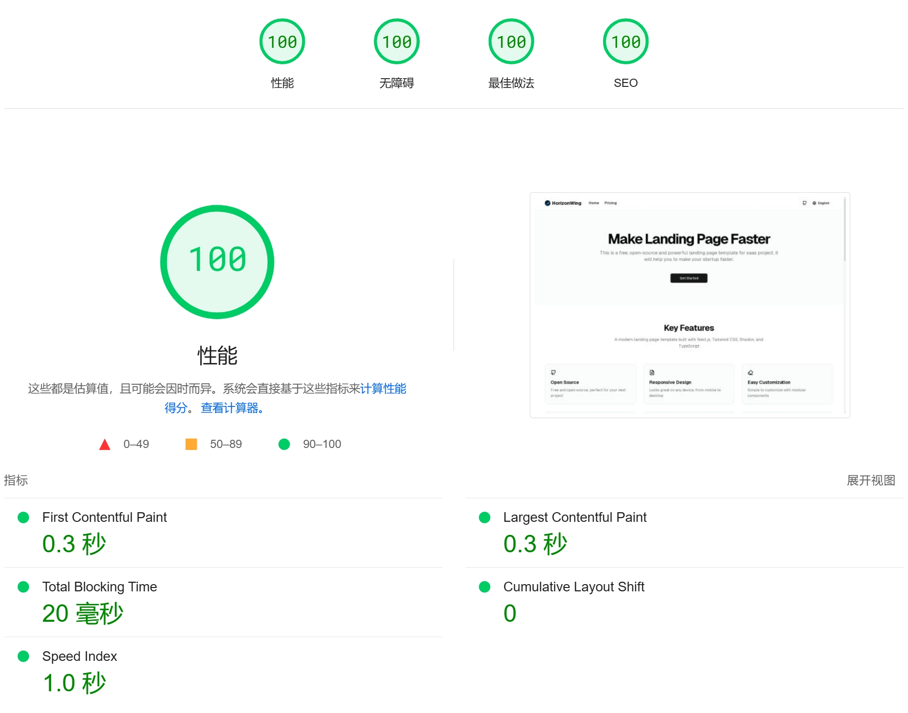
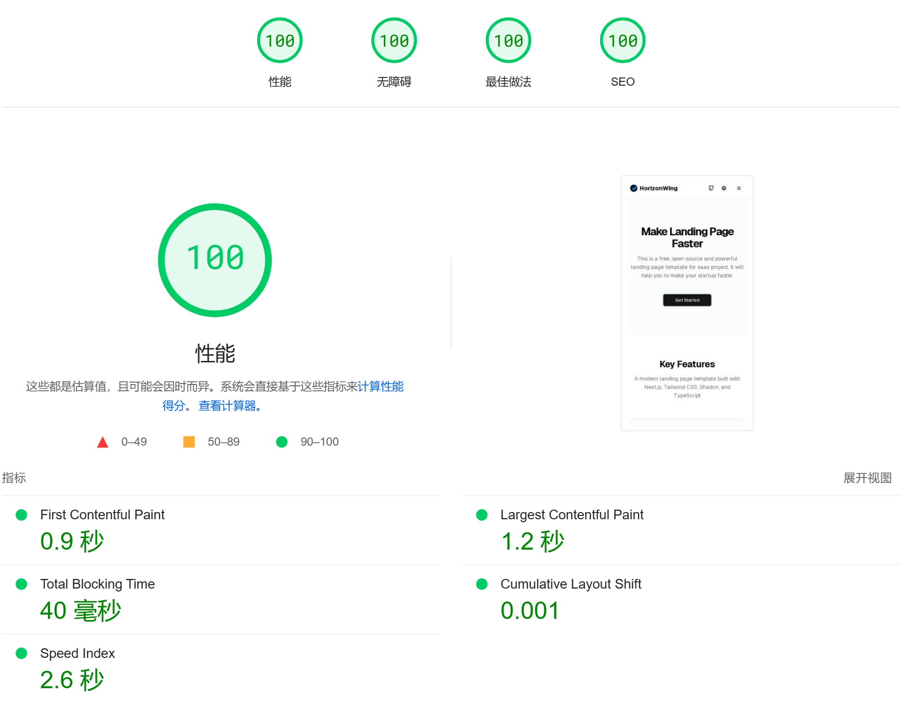

<p align="center">
  
</p>

# HorizonWing 落地页

[English](./README.md) | [中文](./README.zh.md)

一个使用 Next.js、Tailwind CSS 和 next-intl 构建的现代化多语言落地页模板。

## 特性

- 🌐 多语言支持（17种语言）
- 🎨 基于 Tailwind CSS 和 Shadcn UI 的现代界面
- ⚡ 使用 Next.js 14 App Router 构建
- 📱 完全响应式设计
- 🔍 SEO 优化
- 🛠 TypeScript 支持

## 性能指标

PageSpeed Insights 性能评分：

**桌面端性能：**


**移动端性能：**


这些评分展示了本模板在桌面端和移动端的出色性能优化。

## 快速开始

```bash
# 克隆仓库
git clone https://github.com/HorizonWing/horizon-wing-landing-page.git

# 进入项目目录
cd horizon-wing-landing-page

# 安装依赖
pnpm install

# 启动开发服务器
pnpm dev
```

# 使用 Docker 启动

```bash
# .env 配置文件
cp .env.example .env

# docker-compose 启动项目
docker-compose up -d

# 访问地址
# http://localhost:3000
```

## 项目结构

```shell
horizon-wing-landing-page/
├── src/
│   ├── app/              # Next.js 应用路由
│   │   ├── [locale]/    # 国际化路由
│   │   └── layout.tsx   # 根布局
│   ├── components/      # React 组件
│   │   ├── ui/         # UI 组件
│   │   └── sections/   # 页面区块组件
│   ├── styles/         # 全局样式
│   └── lib/            # 工具函数
├── public/             # 静态资源
├── messages/          # 国际化文件
└── tailwind.config.ts # Tailwind 配置
```

## 核心组件

- `Hero` - 响应式主页横幅
- `Feature` - 特性展示网格
- `Testimonial` - 用户评价展示
- `Pricing` - 价格方案展示
- `FAQ` - 可折叠的常见问题
- `CTA` - 引导用户行动组件
- `Footer` - 导航和社交链接

## 国际化

目前支持 17 种语言，包括：

- 阿拉伯语 (العربية)
- 德语 (Deutsch)
- 英语 (English)
- 西班牙语 (Español)
- 法语 (Français)
- 印地语 (हिन्दी)
- 印尼语 (Bahasa Indonesia)
- 意大利语 (Italiano)
- 日语 (日本語)
- 韩语 (한국어)
- 马来语 (Bahasa Melayu)
- 葡萄牙语 (Português)
- 俄语 (Русский)
- 泰语 (ไทย)
- 越南语 (Tiếng Việt)
- 繁体中文
- 简体中文

## 技术栈

- [Next.js 14](https://nextjs.org/)
- [Tailwind CSS](https://tailwindcss.com/)
- [Shadcn UI](https://ui.shadcn.com/)
- [TypeScript](https://www.typescriptlang.org/)
- [next-intl](https://next-intl-docs.vercel.app/)

## 许可证

MIT License © 2024-PRESENT HorizonWing

## 贡献

欢迎提交 Pull Request 来改进这个项目！

## 联系我们

- 问题反馈：[GitHub Issues](https://github.com/HorizonWing/horizon-wing-landing-page/issues)
- 邮件联系：<horizonwingtech@gmail.com>

## 支持项目

如果这个项目对你有帮助，请给它一个 star ⭐️

<a href="https://www.uneed.best/tool/horizonwing-landing-page">
  
</a>
